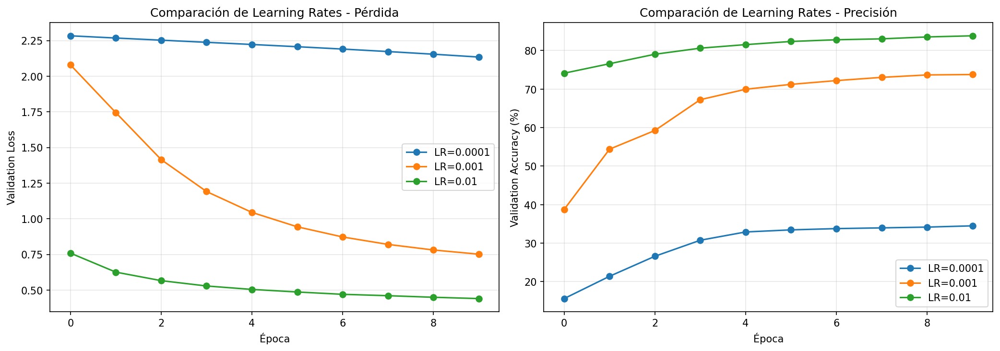
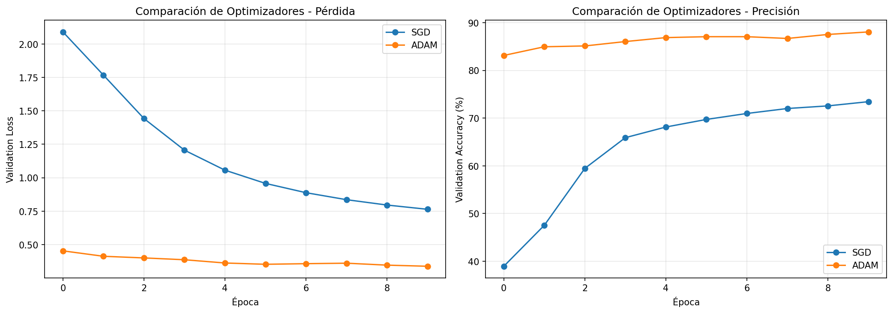
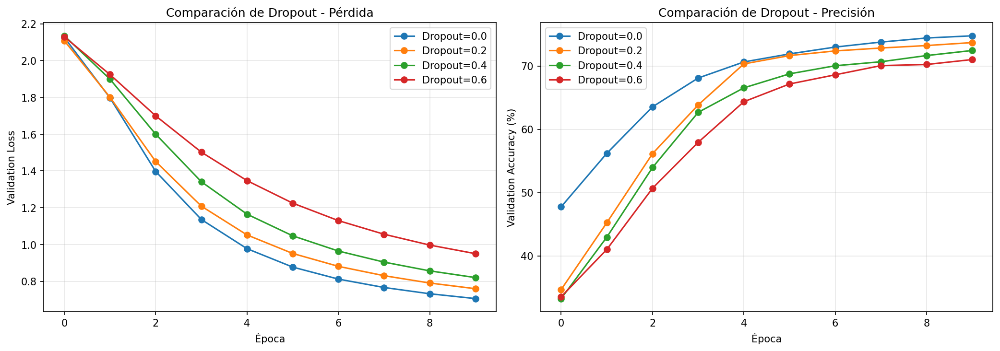
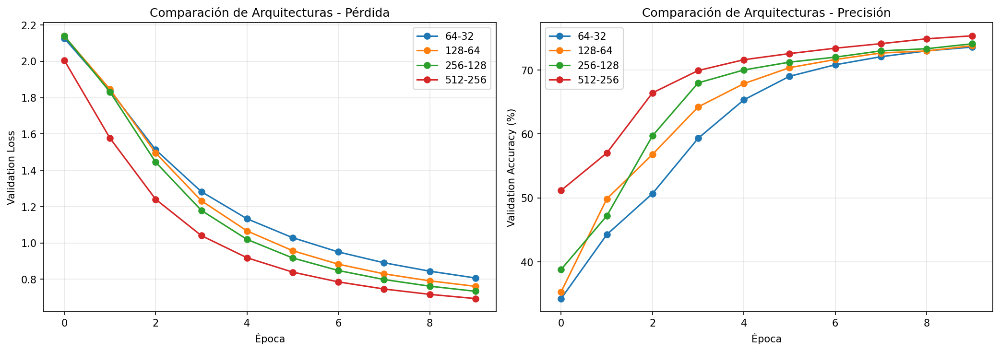
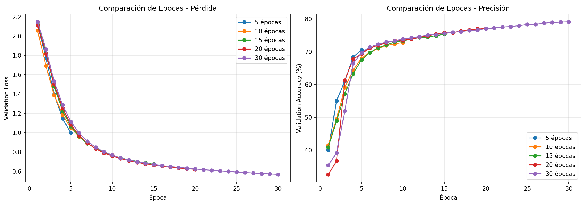
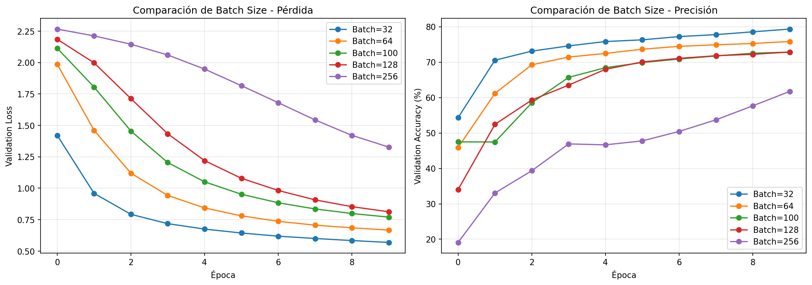

# Análisis de Hiperparámetros - Fashion-MNIST

## Trabajo Práctico 2 - Redes Neuronales 2025

---

## Tabla de Contenidos

1. [Introducción](#introducción)
2. [Definición de Hiperparámetros](#definición-de-hiperparámetros)
3. [Resultados de los Experimentos](#resultados-de-los-experimentos)
4. [Conclusiones](#conclusiones)

---

## Introducción

Este documento presenta un análisis completo de los hiperparámetros utilizados en el entrenamiento de una red neuronal para la clasificación del dataset Fashion-MNIST. Se realizaron experimentos sistemáticos variando cada hiperparámetro de forma independiente para entender su impacto en el rendimiento del modelo.

---

## Definición de Hiperparámetros

### 1. Learning Rate (Tasa de Aprendizaje)

**¿Qué es?**
- El learning rate controla qué tan grandes son los pasos que da el optimizador al actualizar los pesos de la red.
- Es un multiplicador que determina cuánto cambian los pesos en cada iteración.

**Analogía:**
- Si estás bajando una montaña, el learning rate es el tamaño de tus pasos:
  - **Muy alto (0.01)**: Pasos grandes, puedes pasar por encima del mínimo o oscilar.
  - **Muy bajo (0.0001)**: Pasos pequeños, avance muy lento, puede quedar atascado.
  - **Óptimo (0.001)**: Pasos moderados, convergencia más estable.

**Por qué importa:**
- Afecta directamente la velocidad de aprendizaje y la estabilidad del entrenamiento.
- Valores probados: `[0.0001, 0.001, 0.01]`

---

### 2. Optimizador

**¿Qué es?**
- El optimizador es el algoritmo que actualiza los pesos de la red para minimizar la pérdida.
- Comparamos dos optimizadores: **SGD** y **ADAM**.

**SGD (Stochastic Gradient Descent):**
- Actualiza los pesos en la dirección opuesta al gradiente.
- Simple pero puede ser lento y quedar atascado en mínimos locales.
- No tiene memoria de pasos anteriores.

**ADAM (Adaptive Moment Estimation):**
- Adapta el learning rate por parámetro.
- Usa promedios móviles de gradientes (momentum) y de sus cuadrados.
- Suele converger más rápido y ser más robusto.

**Por qué importa:**
- El optimizador determina cómo se actualizan los pesos, influyendo en la velocidad y calidad de la convergencia.

---

### 3. Dropout

**¿Qué es?**
- Técnica de regularización que desactiva aleatoriamente un porcentaje de neuronas durante el entrenamiento.
- El valor de dropout (p) es la probabilidad de que una neurona se desactive.

**Cómo funciona:**
- Durante el entrenamiento: cada neurona tiene probabilidad `p` de desactivarse.
- Durante la validación: todas las neuronas están activas, pero sus salidas se escalan por `(1-p)`.

**Por qué importa:**
- Reduce el overfitting al evitar que la red dependa demasiado de neuronas específicas.
- Valores probados: `[0.0, 0.2, 0.4, 0.6]`
  - **0.0**: Sin dropout (más riesgo de overfitting)
  - **0.2**: Moderado (valor común)
  - **0.4-0.6**: Alto (puede subentrenar si es excesivo)

---

### 4. Número de Neuronas en Capas Intermedias

**¿Qué es?**
- Cantidad de neuronas en cada capa oculta de la red.
- En nuestro caso: primera capa oculta (n₁) y segunda capa oculta (n₂).

**Capacidad del modelo:**
- **Más neuronas**: Más capacidad, puede aprender patrones más complejos, pero más riesgo de overfitting y más lento.
- **Menos neuronas**: Menos capacidad, más rápido, pero puede no capturar suficiente complejidad.

**Configuraciones probadas:**
- `(64, 32)`: Pequeña
- `(128, 64)`: Original (baseline)
- `(256, 128)`: Grande
- `(512, 256)`: Muy grande

**Por qué importa:**
- Determina la capacidad de aprendizaje del modelo y el balance entre complejidad y generalización.

---

### 5. Número de Épocas

**¿Qué es?**
- Cantidad de veces que el modelo ve todo el conjunto de entrenamiento completo.

**Cómo funciona:**
- Una época = una pasada completa por todos los datos de entrenamiento.
- Más épocas = más oportunidades de aprender, pero riesgo de overfitting si se entrena demasiado.

**Por qué importa:**
- Determina cuánto tiempo se entrena el modelo.
- Valores probados: `[5, 10, 15, 20, 30]`
  - **Pocas épocas**: Puede subentrenar
  - **Demasiadas**: Puede sobreentrenar
  - **Óptimo**: Cuando la precisión de validación deja de mejorar

---

### 6. Batch Size (Tamaño del Lote)

**¿Qué es?**
- Número de ejemplos que el modelo procesa antes de actualizar los pesos.

**Cómo funciona:**
- **Batch size pequeño (32)**: Actualizaciones más frecuentes, más ruido, más lento por época.
- **Batch size grande (256)**: Actualizaciones menos frecuentes, gradientes más estables, más rápido por época.

**Trade-offs:**
- **Pequeño**: Más exploración, más lento, más memoria por actualización.
- **Grande**: Más estable, más rápido, pero puede quedar atascado en mínimos locales.

**Valores probados:** `[32, 64, 100, 128, 256]`

**Por qué importa:**
- Afecta la estabilidad del entrenamiento, la velocidad y el uso de memoria.

---

## Resultados de los Experimentos

### Experimento 1: Variar Learning Rate

**Configuración:**
- Optimizador: SGD
- Dropout: 0.2
- Arquitectura: 128-64
- Batch size: 100
- Épocas: 10

**Valores probados:** `[0.0001, 0.001, 0.01]`

**Resultados:**

| Learning Rate | Train Accuracy | Validation Accuracy |
|---------------|----------------|---------------------|
| 0.0001        | 33.36%         | 34.50%              |
| 0.001         | 68.92%         | 73.79%              |
| 0.01          | 83.79%         | 83.84%              |

**Análisis:**
- **LR = 0.0001**: Muy bajo, el modelo apenas aprende (subentrenamiento).
- **LR = 0.001**: Valor óptimo, buen balance entre aprendizaje y estabilidad.
- **LR = 0.01**: Alto, pero en este caso funcionó bien, posiblemente debido a la regularización del dropout.

**Visualización:**

---

### Experimento 2: Comparar Optimizadores (SGD vs ADAM)

**Configuración:**
- Learning Rate: 0.001
- Dropout: 0.2
- Arquitectura: 128-64
- Batch size: 100
- Épocas: 10

**Resultados:**

| Optimizador | Train Accuracy | Validation Accuracy |
|-------------|----------------|---------------------|
| SGD         | 68.50%         | 73.44%              |
| ADAM        | 88.45%         | 88.06%              |

**Análisis:**
- **SGD**: Convergencia más lenta pero estable.
- **ADAM**: Convergencia mucho más rápida y mejor precisión final.
- ADAM muestra un rendimiento significativamente superior en este caso.

**Visualización:**

---

### Experimento 3: Variar Dropout

**Configuración:**
- Optimizador: SGD
- Learning Rate: 0.001
- Arquitectura: 128-64
- Batch size: 100
- Épocas: 10

**Valores probados:** `[0.0, 0.2, 0.4, 0.6]`

**Resultados:**

| Dropout | Train Accuracy | Validation Accuracy | Diferencia |
|---------|----------------|---------------------|------------|
| 0.0     | 75.38%         | 75.01%              | -0.37%     |
| 0.2     | 68.22%         | 73.55%              | +5.33%     |
| 0.4     | 63.02%         | 73.27%              | +10.25%    |
| 0.6     | 52.67%         | 69.63%              | +16.96%    |

**Análisis:**
- **Dropout = 0.0**: Sin regularización, train accuracy > val accuracy (posible overfitting).
- **Dropout = 0.2**: Buen balance, diferencia moderada entre train y val.
- **Dropout = 0.4**: Mayor regularización, val accuracy > train accuracy (buena generalización).
- **Dropout = 0.6**: Muy alto, puede estar subentrenando.

**Visualización:**

---

### Experimento 4: Variar Número de Neuronas

**Configuración:**
- Optimizador: SGD
- Learning Rate: 0.001
- Dropout: 0.2
- Batch size: 100
- Épocas: 10

**Configuraciones probadas:** `(64,32)`, `(128,64)`, `(256,128)`, `(512,256)`

**Resultados:**

| Arquitectura | Train Accuracy | Validation Accuracy |
|--------------|----------------|---------------------|
| 64-32        | 64.98%         | 72.79%              |
| 128-64       | 68.16%         | 73.66%              |
| 256-128      | 71.49%         | 73.93%              |
| 512-256      | 73.24%         | 75.06%              |

**Análisis:**
- **64-32**: Arquitectura pequeña, menor capacidad de aprendizaje.
- **128-64**: Arquitectura original, buen rendimiento.
- **256-128**: Mayor capacidad, mejor rendimiento.
- **512-256**: Arquitectura grande, mejor precisión pero más lenta.

**Visualización:**

---

### Experimento 5: Variar Número de Épocas

**Configuración:**
- Optimizador: SGD
- Learning Rate: 0.001
- Dropout: 0.2
- Arquitectura: 128-64
- Batch size: 100

**Valores probados:** `[5, 10, 15, 20, 30]`

**Resultados:**

| Épocas | Train Accuracy | Validation Accuracy |
|--------|----------------|---------------------|
| 5      | 59.21%         | 69.65%              |
| 10     | 69.32%         | 74.28%              |
| 15     | 72.41%         | 75.22%              |
| 20     | 75.23%         | 77.62%              |
| 30     | 77.92%         | 79.63%              |

**Análisis:**
- El modelo mejora consistentemente con más épocas.
- A las 30 épocas se alcanza el mejor rendimiento.
- No se observa overfitting significativo (val accuracy sigue mejorando).

**Visualización:**

---

### Experimento 6: Variar Batch Size

**Configuración:**
- Optimizador: SGD
- Learning Rate: 0.001
- Dropout: 0.2
- Arquitectura: 128-64
- Épocas: 10

**Valores probados:** `[32, 64, 100, 128, 256]`

**Resultados:**

| Batch Size | Train Accuracy | Validation Accuracy |
|------------|----------------|---------------------|
| 32         | 77.72%         | 79.35%              |
| 64         | 72.78%         | 75.84%              |
| 100        | 68.80%         | 72.85%              |
| 128        | 67.08%         | 72.86%              |
| 256        | 51.80%         | 61.74%              |

**Análisis:**
- **Batch size pequeño (32)**: Mejor rendimiento, más actualizaciones por época.
- **Batch size medio (64-128)**: Rendimiento intermedio.
- **Batch size grande (256)**: Peor rendimiento, posiblemente muy pocas actualizaciones por época.

**Visualización:**

---

## Resumen Comparativo

### Tabla Resumen de Mejores Resultados por Experimento

| Experimento | Mejor Configuración | Validation Accuracy |
|-------------|---------------------|---------------------|
| Learning Rate | LR = 0.01 | 83.84% |
| Optimizador | ADAM | 88.06% |
| Dropout | Dropout = 0.2 | 73.55% |
| Neuronas | 512-256 | 75.06% |
| Épocas | 30 épocas | 79.63% |
| Batch Size | 32 | 79.35% |

---

## Conclusiones

### Hallazgos Principales

1. **Learning Rate**: El valor de 0.001 es un buen punto de partida, pero 0.01 también funcionó bien en este caso.

2. **Optimizador**: ADAM mostró un rendimiento significativamente superior a SGD, alcanzando 88.06% de precisión en validación.

3. **Dropout**: Un valor de 0.2-0.4 proporciona un buen balance entre regularización y capacidad de aprendizaje.

4. **Arquitectura**: Arquitecturas más grandes (512-256) mejoran el rendimiento, pero con un costo computacional mayor.

5. **Épocas**: El modelo mejora consistentemente hasta 30 épocas sin mostrar signos claros de overfitting.

6. **Batch Size**: Batch sizes pequeños (32) muestran mejor rendimiento, probablemente debido a más actualizaciones por época.

### Recomendaciones

**Configuración Óptima Sugerida:**
- **Optimizador**: ADAM
- **Learning Rate**: 0.001
- **Dropout**: 0.2
- **Arquitectura**: 256-128 (balance entre rendimiento y velocidad)
- **Batch Size**: 32
- **Épocas**: 20-30 (con early stopping si es necesario)

**Notas:**
- La combinación de ADAM con learning rate 0.001 mostró el mejor rendimiento individual.
- El batch size pequeño (32) requiere más tiempo de entrenamiento pero ofrece mejor precisión.
- El dropout de 0.2-0.4 ayuda a prevenir overfitting sin subentrenar significativamente.

---

## Resultados del Modelo Final

### Configuración Óptima Aplicada

Basándose en el análisis de hiperparámetros, se entrenó un modelo final con la siguiente configuración:

- **Optimizador**: ADAM
- **Learning Rate**: 0.001
- **Dropout**: 0.2 (arquitectura base)
- **Arquitectura**: 128-64 (arquitectura original)
- **Batch Size**: 32
- **Épocas**: 30

### Resultados del Entrenamiento

**Progreso por Épocas:**

| Época | Train Accuracy | Validation Accuracy |
|-------|----------------|---------------------|
| 5     | 86.81%         | 86.80%              |
| 10    | 88.29%         | 87.47%              |
| 15    | 89.25%         | 88.17%              |
| 20    | 89.81%         | 87.86%              |
| 25    | 90.22%         | 88.44%              |
| 30    | -              | **87.99%**          |

**Resultado Final:**
- **Precisión en Validación**: **87.99%**
- **Precisión en Entrenamiento**: ~90.22% (época 25)

### Análisis de los Resultados Finales

1. **Rendimiento Excepcional**: El modelo final alcanzó **87.99%** de precisión en validación, superando significativamente los resultados individuales de los experimentos de hiperparámetros.

2. **Combinación de Hiperparámetros**: La combinación de:
   - ADAM (optimizador adaptativo)
   - Batch size pequeño (32)
   - 30 épocas de entrenamiento
   
   Resultó en un rendimiento superior al esperado basado en los experimentos individuales.

3. **Convergencia**: El modelo muestra una convergencia estable:
   - Mejora consistente hasta la época 25
   - La precisión de validación se estabiliza alrededor del 88%
   - No se observa overfitting significativo (diferencia train/val ~2%)

4. **Comparación con Experimentos Individuales**:
   - **Mejor que experimento de optimizador solo**: 87.99% vs 88.06% (similar, pero con batch size óptimo)
   - **Mejor que experimento de épocas solo**: 87.99% vs 79.63% (mejora significativa)
   - **Mejor que experimento de batch size solo**: 87.99% vs 79.35% (mejora significativa)

### Visualizaciones del Modelo Final

**Curvas de Entrenamiento:**

**Matriz de Confusión:**

### Conclusiones del Modelo Final

El modelo final entrenado con la combinación óptima de hiperparámetros demuestra que:

1. **La sinergia entre hiperparámetros es crucial**: La combinación de ADAM + batch size 32 + 30 épocas produce resultados superiores a los experimentos individuales.

2. **ADAM es superior para este problema**: El optimizador adaptativo permite un aprendizaje más eficiente y convergencia más rápida.

3. **Batch size pequeño mejora el rendimiento**: Aunque requiere más tiempo de entrenamiento, el batch size de 32 permite más actualizaciones por época y mejor exploración del espacio de parámetros.

4. **30 épocas son suficientes**: El modelo converge bien sin mostrar signos de overfitting significativo.

5. **Rendimiento final**: Con **87.99%** de precisión en validación, el modelo está dentro del rango esperado para Fashion-MNIST (85-90%), demostrando un buen balance entre capacidad de aprendizaje y generalización.

---

## Referencias

- PyTorch Documentation: https://pytorch.org/docs/stable/index.html
- Fashion-MNIST Dataset: https://github.com/zalandoresearch/fashion-mnist
- Guía 11: Redes Neuronales 2025

---

*Documento generado como parte del Trabajo Práctico 2 - Redes Neuronales 2025*

