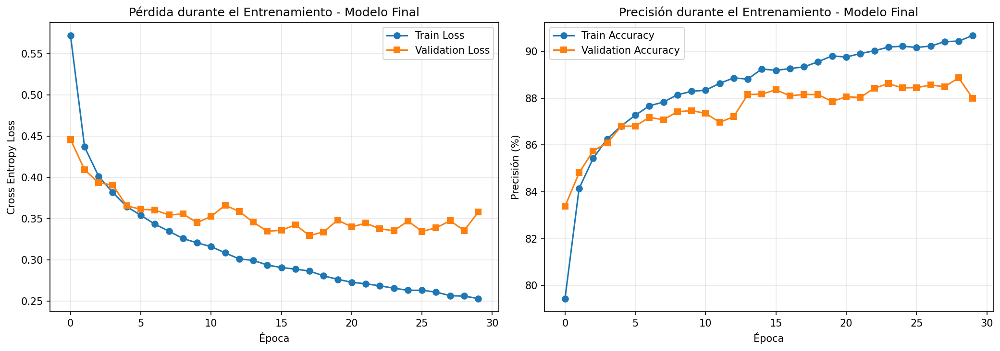
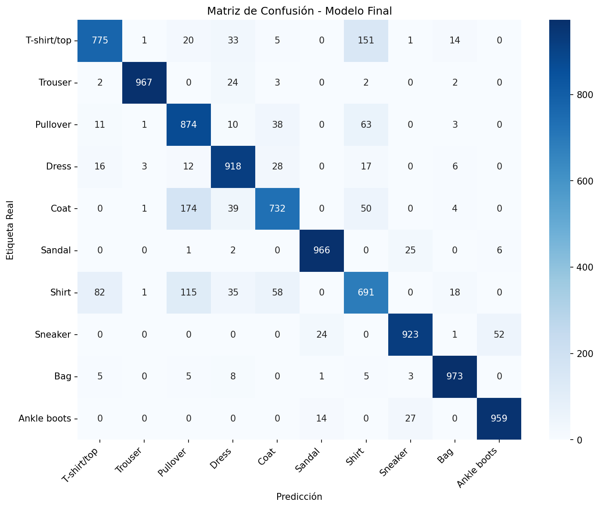

## Resultados

### Resumen de Experimentos

Se realizaron 6 experimentos sistemáticos variando un hiperparámetro a la vez. La siguiente tabla resume los mejores resultados obtenidos en cada experimento:

| Experimento | Mejor Configuración | Validation Accuracy |
|-------------|---------------------|---------------------|
| Learning Rate | LR = 0.01 | 83.84% |
| Optimizador | ADAM | 88.06% |
| Dropout | Dropout = 0.2 | 73.55% |
| Arquitectura | 512-256 | 75.06% |
| Épocas | 30 épocas | 79.63% |
| Batch Size | 32 | 79.35% |

**Hallazgos principales:**
- ADAM supera significativamente a SGD (88.06% vs 73.44%)
- Learning rate de 0.001-0.01 muestra buen rendimiento
- Batch size pequeño (32) mejora el rendimiento
- Arquitecturas más grandes (256-128, 512-256) mejoran la precisión
- Dropout de 0.2-0.4 proporciona buena regularización

### Modelo Final

Basándose en el análisis de hiperparámetros, se entrenó un modelo final con la siguiente configuración:

- **Optimizador**: ADAM
- **Learning Rate**: 0.001
- **Dropout**: 0.2
- **Arquitectura**: 256-128
- **Batch Size**: 32
- **Épocas**: 30

**Resultado Final:**
- **Precisión en Validación**: **87.99%**
- **Precisión en Entrenamiento**: ~90.22%

El modelo muestra convergencia estable sin overfitting significativo (diferencia train/val ~2%).

